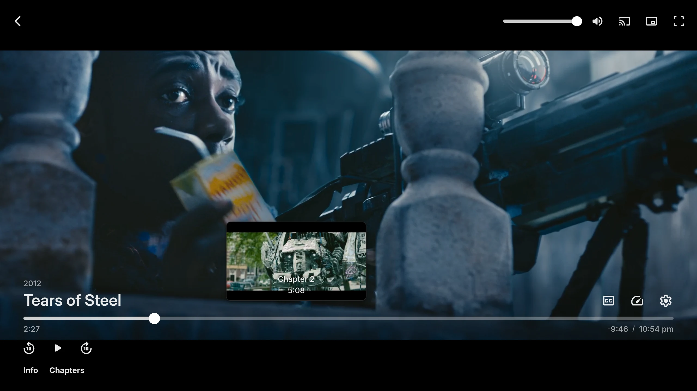

Emby's built-in video preview thumbnail extraction has no GPU option. Emby staff describe it as FFmpeg plus Emby's own BIF writer. To make Emby's BIF files on a GPU, run Media Preview Generator in Docker. It decodes each video with FFmpeg on an NVIDIA, Intel or AMD GPU. It then saves `<video name>-320-10.bif` next to the video, the file name Emby itself uses when it saves previews into media folders, and tells Emby to pick it up. This needs write access to the media folder.

*Emby's web player on a test server. Tears of Steel, (CC) Blender Foundation \| mango.blender.org, [CC BY 3.0](https://creativecommons.org/licenses/by/3.0/).*

## What Emby does on its own

- **Built in, no Premiere needed.** Video preview thumbnails are a per-library setting. They are not on Emby's [Premiere feature list](https://emby.media/support/articles/Premiere-Feature-Matrix.html).
- **CPU only.** Staff reply: "We use ffmpeg to create the images, and our own code to write the bif files" ([forum](https://emby.media/community/topic/96831-i-just-want-to-generate-the-thumbnail-previews-bif/)).
- **Runs as a scheduled task or during library scans.** Users report it only reliably picks up newly detected files, not older items missing a BIF ([forum](https://emby.media/community/topic/136433-question-about-video-preview-thumbnail-extraction-scheduled-task/), user report).
- **HDR.** Emby's core now tone-maps BIF images, per forum reports. A community plugin did this before the core did ([forum](https://emby.media/community/topic/118095-suggestion-for-bif-file-generation/), user report).

> [!NOTE]
> A GPU doesn't always help. One Emby plugin developer argues most of the time goes on reading and seeking the file, so hardware decode gains little ([forum](https://emby.media/community/topic/49481-fr-use-hw-acceleration-for-chapter-image-extraction/)). On slow or busy disks that's true for this project too. A GPU helps when storage can keep up. On multi-disk shares, see the FAQ on [disk-bound setups](faq.md#why-is-generation-slow-on-my-unraid-or-mergerfs-array).

## How Media Preview Generator makes Emby BIFs

1. A trigger arrives: a webhook, a schedule, a "Recently Added" poll, or a manual pick.
2. FFmpeg decodes the file on a GPU worker, and downscales and tone-maps HDR there. If the GPU can't decode a file, the same worker retries it on the CPU.
3. The frames are packed into a BIF named `<video name>-<width>-<interval>.bif` and saved next to the video. Width defaults to 320, and the interval is your frame interval (default 10 seconds).
4. The app tells Emby the file changed so Emby picks it up.

If the same file is also in Plex or Jellyfin, it is decoded once and each server gets its own output ([multi-server guide](multi-server.md)).

When Sonarr or Radarr upgrades a file, the old file's BIF is removed. A companion `.meta` file records the source file's size and modification time. Later triggers skip files whose BIF is current, and redo files that were replaced ([smart dedup](multi-server.md#smart-dedup-skipping-work-thats-already-done)).

## Setup

1. Run the container with your GPU passed through. See [Getting Started — GPU Acceleration](getting-started.md#gpu-acceleration) for the per-vendor `docker run` flags.
2. **Mount the media folder read-write.** The BIF is written beside each video, so a `:ro` mount makes every write fail with "permission denied". Set `PUID`/`PGID` to a user that can write there. Emby doesn't need Plex's `/plex` mount.
3. Add the Emby server in the setup wizard or under **Servers**. Use the server URL plus a username and password, or an API key.
4. Add **path mappings** if Emby and the container see the media at different paths ([Path Mappings](reference.md#path-mappings)).
5. Open the server's **Previews Readiness** panel. It recommends turning off Emby's own scan-time thumbnail extraction and chapter-image extraction, so Emby doesn't repeat the work. It also recommends turning on real-time monitoring, so new files are noticed quickly. Each is one click ([details](guides/previews-readiness.md#vendor-extraction)).

## Triggers for Emby

- **Emby webhooks (needs Emby Premiere).** Go to **Dashboard → Webhooks → Add Webhook**. Point it at `https://<this-app>/api/webhooks/incoming?token=<webhook secret>` and tick **Library → New Media Added**. The app recognises Emby's payload by its shape.
- **Sonarr and Radarr.** No Premiere needed. See [Previews as soon as Sonarr or Radarr imports a file](sonarr-radarr-preview-thumbnails.md).
- **Recently Added schedule.** No Premiere needed. It polls Emby for items added within a lookback window ([details](guides.md#option-b--recently-added-scanner-universal)).
- **Schedules and manual jobs.** Use these for full-library runs and one-off regeneration.

## Other Emby BIF tools

- The community **"MediaInfo for Emby"** plugin family added HDR-to-SDR tone mapping for BIFs. It dropped that once Emby's core did it. It is distributed through the Emby forum ([thread](https://emby.media/community/topic/108984-mediainfo-for-emby-pluginhdr-vision-atmos-dtsx/page/54/)).
- An older alpha Windows CLI, **"Bif Generator"**, predates Emby's native BIF support. It is a manual tool ([forum](https://emby.media/community/topic/71614-bif-generator-windows-tool/)).
- Generic BIF CLIs such as [bifgen](https://github.com/entrez/bifgen) make one BIF from one file, with no GPU path and no Emby integration.

See the [comparison page](comparison.md) for when Emby's built-in is the better pick.

## Limits

- Docker only, with a web UI and no CLI.
- Write access to the media folders is required for Emby output.
- On Windows only NVIDIA GPUs are accelerated, and on macOS none are.
- Dolby Vision Profile 5 needs a hardware Vulkan driver in the container ([HDR and Dolby Vision](hdr-dolby-vision-thumbnails.md)).
- It doesn't make chapter images.
