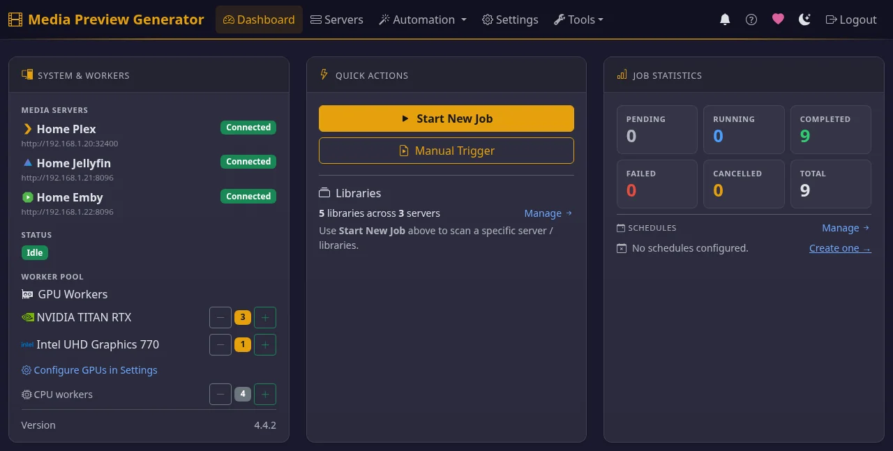

# Media Preview Generator

Media Preview Generator is a free, MIT-licensed Docker app that makes the video preview thumbnails for Plex, Emby and Jellyfin. These are the small images you see while dragging along a video's timeline. It makes them with FFmpeg on your GPU, instead of leaving the job to each server's built-in generator. It is for self-hosters with large or growing libraries who want previews ready soon after a file arrives. It is also for anyone running more than one of these servers on the same files.

## What it does

- **Makes previews on a GPU.** FFmpeg decodes and downscales each video on an NVIDIA, Intel or AMD GPU, with several files in parallel. If a file won't decode on the GPU, the same worker redoes it on the CPU.
- **Serves several servers from one decode.** When Plex, Emby and Jellyfin hold the same file, the video is decoded once. Each server then gets its own native output: a BIF inside Plex's data folder, a BIF next to the video for Emby, and trickplay tiles for Jellyfin.
- **Starts when a file arrives.** Triggers include:
    - Sonarr, Radarr, Tdarr and FileFlows webhooks.
    - Plex, Emby and Jellyfin webhooks.
    - A "Recently Added" poll, cron or interval schedules, or a manual pick by title.

    If a server hasn't indexed a new file yet, the app retries after 1, 2 and 5 minutes by default.
- **Handles HDR.** HDR10, HLG, HDR10+ and Dolby Vision are tone-mapped to SDR, so previews aren't washed out or green.
- **Checks server settings.** A **Previews Readiness** panel audits each server's settings that affect whether previews show up, and can fix them in one click.

## Supported servers and GPUs

- **Plex Media Server:** needs Plex's data folder mounted read-write in the container.
- **Emby:** needs the media folder mounted read-write, because the BIF is saved next to each video.
- **Jellyfin 10.10 or newer:** tiles are saved next to each video by default, with the media mounted read-write. With the optional Media Preview Bridge plugin, they can go in Jellyfin's data folder instead.
- **GPUs:** NVIDIA (CUDA), Intel and AMD (VAAPI) on Linux. On Windows (Docker Desktop, WSL2), only NVIDIA. On macOS none. Without a GPU it runs on CPU workers.

## Get started

1. Run the Docker image `stevezzau/media_preview_generator` with your GPU and folders mounted. [Getting Started](getting-started.md) has the `docker run` and Compose examples per GPU vendor, plus Unraid.
2. Open `http://YOUR_IP:8080` and log in with the token from the container logs.
3. Add your servers in the setup wizard. Then turn off each server's own preview generation so the work isn't done twice.

## Is it right for you?

Start with the [comparison with the Plex, Jellyfin and Emby built-in generators](comparison.md). The built-ins need no setup, and for many libraries they are enough. That page says when to stay with them.

Answers to specific problems:

- [Why Plex video preview thumbnails take so long, and how to speed them up](plex-preview-thumbnails-slow.md)
- [Generate Plex preview thumbnails with a GPU (NVIDIA, Intel, AMD)](plex-preview-thumbnails-gpu.md)
- [Faster Jellyfin trickplay generation](jellyfin-trickplay-gpu.md)
- [Emby preview thumbnails (BIF) with GPU acceleration](emby-bif-thumbnails-gpu.md)
- [Generate previews as soon as Sonarr or Radarr imports a file](sonarr-radarr-preview-thumbnails.md)
- [HDR and Dolby Vision preview thumbnails without washed-out or green frames](hdr-dolby-vision-thumbnails.md)

## Limits

- **Docker only.** There is no native installer and no PyPI package.
- **Web UI only.** There is no CLI. A token-authenticated [REST API](reference.md#rest-api) covers automation.
- **Write access.** It must be able to write where each server keeps previews: Plex's data folder, or the media folders for Emby and Jellyfin.
- **Dolby Vision Profile 5 on NVIDIA** needs `NVIDIA_DRIVER_CAPABILITIES=all`. See [HDR & Dolby Vision](guides.md#hdr--dolby-vision).
- **No GPU acceleration on macOS**, or for AMD and Intel GPUs on Windows. Those setups run on CPU.
- **Video preview thumbnails only.** It makes no chapter thumbnails and does no intro or credit detection.

## More

- [Guides & Troubleshooting](guides.md): web UI, webhooks, schedules, fixes
- [Multi-Server](multi-server.md): output formats, webhook routing, retries
- [Configuration & API Reference](reference.md): every setting and endpoint
- [FAQ](faq.md)
- Source and issues: [GitHub](https://github.com/stevezau/media_preview_generator). Image: [Docker Hub](https://hub.docker.com/r/stevezzau/media_preview_generator).
