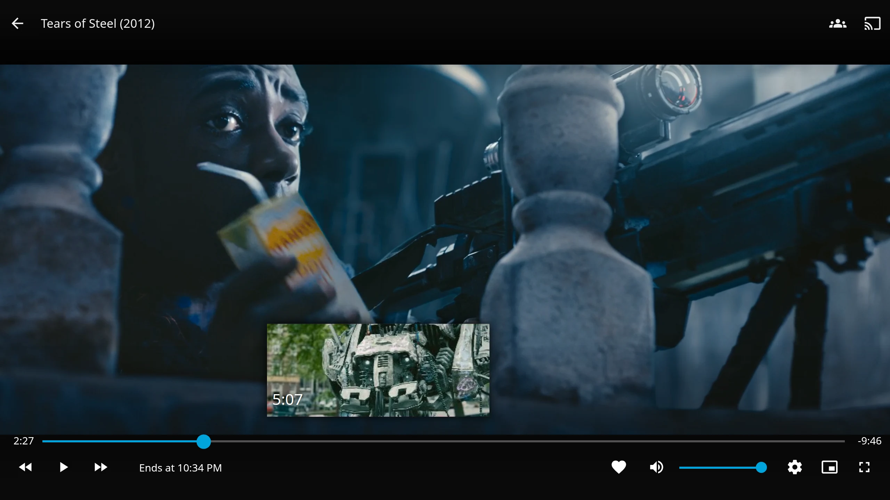

Jellyfin (10.9+) makes trickplay images itself. The quickest wins are in its own trickplay options, most of which ship off:

- Turn on key-frame-only extraction.
- Raise the FFmpeg thread count from its default of 1.
- Try hardware decoding.
- For HDR, turn on tone mapping in the transcoding settings.

If a backlog is still too slow, you can move the work off Jellyfin. You might want it on another machine, or you might run Plex or Emby too. Media Preview Generator can write Jellyfin's native trickplay tiles from a GPU in its own Docker container. That needs Jellyfin 10.10 or newer.



*Jellyfin's web player on a test server. Tears of Steel, (CC) Blender Foundation \| mango.blender.org, [CC BY 3.0](https://creativecommons.org/licenses/by/3.0/).*

## Start with Jellyfin's own settings

These live under **Dashboard → Playback → Trickplay**. Defaults are from Jellyfin's [`TrickplayOptions.cs`](https://github.com/jellyfin/jellyfin/blob/master/MediaBrowser.Model/Configuration/TrickplayOptions.cs), checked 23 September 2026.

- **Key-frame-only extraction** (`EnableKeyFrameOnlyExtraction`, default off). Jellyfin's own description: "Significantly faster, but is not compatible with all decoders and/or video files." Try it first.
- **FFmpeg threads** (`ProcessThreads`, default 1). Raise it if the server has spare cores.
- **Process priority** (`ProcessPriority`, default below normal). Playback wins when the CPU is busy, at the cost of slower trickplay.
- **Hardware decoding** (`EnableHwAcceleration`, default off).
- **Hardware MJPEG encoding** (`EnableHwEncoding`, default off). Jellyfin's help text says it only works with QSV, VA-API, VideoToolbox and RKMPP ([source](https://github.com/jellyfin/jellyfin-web/blob/master/src/strings/en-us.json)).
- **Interval and width** (default 10 seconds, 320 px, 10×10 tiles). A longer interval means fewer frames to make.

Hardware decoding is not a guaranteed win. A Jellyfin core team member [has said](https://forum.jellyfin.org/t-solved-trickplay-slow-w-nvidia-gpu-nvdec) its use in 10.9 trickplay is "not the most efficient". Users report it failing on some files, or not measurably beating the CPU ([#13468](https://github.com/jellyfin/jellyfin/issues/13468)). Test on a few files before relying on it.

**HDR looks grey or washed out?** Jellyfin only tone-maps trickplay when tone mapping is on in its transcoding settings. A core developer confirmed this in [#13142](https://github.com/jellyfin/jellyfin/issues/13142). A Dolby Vision colour fix landed via [#8049](https://github.com/jellyfin/jellyfin/issues/8049), but green-tinted Dolby Vision trickplay is still [reported by users](https://www.reddit.com/r/jellyfin/comments/1spfb8q/trickplay_images_with_incorrect_colors_for_dolby/) in 2026.

## When to move it off Jellyfin

- A large backlog still takes days after tuning.
- You want the decoding done on another machine or a different GPU.
- You want trickplay made per file as soon as Sonarr or Radarr imports it ([how](sonarr-radarr-preview-thumbnails.md)).
- You also run Plex or Emby on the same files. Media Preview Generator decodes each file once and writes each server's format.

If none of these apply, the built-in is simpler. See the [comparison](comparison.md).

## How Media Preview Generator writes trickplay

It writes Jellyfin's own "saved with media" layout, next to each video:

```text
Movie (2010).trickplay/
    320 - 10x10/
        0.jpg   # sheet of 10×10 thumbnails
        1.jpg
```

Tiles are written to a staging folder first, then moved into place, so Jellyfin never reads half a set. Jellyfin adopts these tiles as its own and doesn't run FFmpeg on them again. Details are in [Per-vendor output formats](multi-server.md#per-vendor-output-formats).

What that needs:

- **Jellyfin 10.10 or newer** ([why](guides/previews-readiness.md#version)).
- **The media folder mounted read-write** in the container, because the tiles are written beside the video. Match `PUID`/`PGID` to the media's owner.
- **Library settings:**
  - Trickplay extraction (`EnableTrickplayImageExtraction`) on.
  - "Save trickplay with media" (`SaveTrickplayWithMedia`) on.
  - Scan-time extraction set as described below.
- **Matching tile geometry** in Jellyfin's server trickplay options. The **Sync options** button does this ([details](guides/previews-readiness.md#trickplay-options)).

> [!WARNING]
> Don't turn trickplay extraction off on a library. When `EnableTrickplayImageExtraction` is off, Jellyfin deletes the `.trickplay` folders on its next refresh, including ones this app wrote. The app asks you to type a confirmation before it will flip that setting.

The **Previews Readiness** panel (Servers → edit the Jellyfin server) checks all of these and can fix them in one click. See [Previews Readiness](guides/previews-readiness.md).

## When you need the Media Preview Bridge plugin

The plugin tells Jellyfin about tiles that something else wrote ([plugin README](https://github.com/stevezau/media_preview_generator/blob/main/jellyfin-plugin/README.md)).

- **Tiles next to the media (the default): optional.**
  - With the plugin, new trickplay appears as soon as the tiles are written. Turn scan-time extraction off.
  - Without it, keep "Extract trickplay images during library scan" on. Jellyfin then picks the tiles up on its next library scan, or at the latest with its daily trickplay task (3 AM by default).
- **Tiles off the media drive: required.** In this mode the app writes into Jellyfin's data folder (`<config>/data/trickplay/…`), not next to the video. It needs the plugin, Jellyfin's config folder mounted read-write in this container, and `SaveTrickplayWithMedia` off. The media itself can then stay read-only. See [off-media mode](guides/previews-readiness.md#jellyfin-config-folder).

Install it with one click from the Servers page. Or add this repository in Jellyfin → **Dashboard → Plugins → Repositories**, then install **Media Preview Bridge**:

```text
https://mediapreviewgenerator.dev/jellyfin-plugin/manifest.json
```

## Triggering from Jellyfin

Install Jellyfin's **Webhook** plugin. Add a Generic destination pointing at `https://<this-app>/api/webhooks/incoming?token=<webhook secret>`, and subscribe it to **Item Added**. The app recognises Jellyfin's payload and looks up the file path. A "Recently Added" schedule also works with Jellyfin, and needs no plugin. See [Webhook configuration per vendor](multi-server.md#webhook-configuration-per-vendor).

## Limits

- Docker only, with a web UI and no CLI.
- On Windows only NVIDIA GPUs are accelerated, and on macOS none are.
- New files are retried after 1, 2 and 5 minutes by default while Jellyfin indexes them ([retry queue](multi-server.md#slow-backoff-retry-queue)).
- It doesn't make chapter images.
