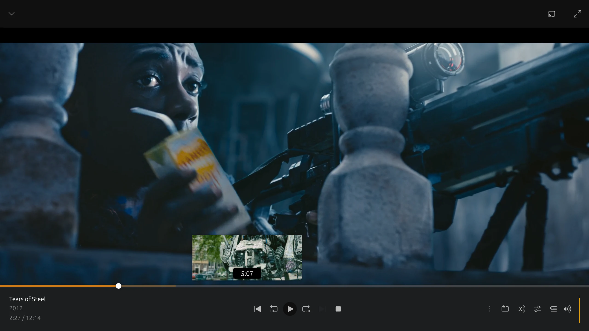

Plex's built-in preview thumbnail generator documents no GPU option. Plex describes it as a CPU-intensive job. To make Plex's preview thumbnails on a GPU, run Media Preview Generator in Docker and pass the GPU through:

- **NVIDIA:** `--gpus all` with `NVIDIA_DRIVER_CAPABILITIES=all`.
- **Intel or AMD:** `--device /dev/dri`.

It decodes each video with FFmpeg on the GPU and writes the BIF file into Plex's data folder. Plex then serves it as if Plex had made it. GPU acceleration works on Linux hosts, and on Windows for NVIDIA only.



*Plex's web player on a test server. Tears of Steel, (CC) Blender Foundation \| mango.blender.org, [CC BY 3.0](https://creativecommons.org/licenses/by/3.0/).*

## What's supported

- **Linux:** NVIDIA (CUDA), Intel (VAAPI, the QuickSync hardware) and AMD (VAAPI).
- **Windows (Docker Desktop, WSL2 backend):** NVIDIA only. AMD and Intel GPUs can't be reached from Docker's Linux VM, so those setups run on CPU.
- **macOS:** no GPU acceleration under Docker. It runs on CPU, using the native ARM64 image on Apple Silicon.
- **No GPU:** set CPU workers in **Settings → Processing Options**.
- **Several GPUs:** each detected GPU gets its own row in **Settings → Processing Options**. Each row has an on/off switch, a worker count and an FFmpeg thread count.

Details and caveats are in [Getting Started — GPU Acceleration](getting-started.md#gpu-acceleration).

## Run it

Intel or AMD:

```bash
docker run -d \
  --name media-preview-generator \
  --restart unless-stopped \
  -p 8080:8080 \
  --device /dev/dri:/dev/dri \
  -e PUID=1000 -e PGID=1000 \
  -v /path/to/media:/media:ro \
  -v "/path/to/Plex Media Server":/plex \
  -v /path/to/app/config:/config \
  stevezzau/media_preview_generator:latest
```

NVIDIA: install the [NVIDIA Container Toolkit](https://docs.nvidia.com/datacenter/cloud-native/container-toolkit/install-guide.html) on Linux (Docker Desktop on Windows provides it). Then replace the `--device` line with:

```bash
  --gpus all \
  -e NVIDIA_VISIBLE_DEVICES=all \
  -e NVIDIA_DRIVER_CAPABILITIES=all \
```

Use `all`, not `compute,video,utility`. The `graphics` capability that `all` includes loads NVIDIA's Vulkan driver into the container. Dolby Vision Profile 5 thumbnails need it. See [HDR and Dolby Vision thumbnails](hdr-dolby-vision-thumbnails.md).

For Docker Compose, Unraid and permission problems with `/dev/dri`, see:

- [Intel iGPU](getting-started.md#intel-igpu-quicksync)
- [NVIDIA GPU](getting-started.md#nvidia-gpu)
- [AMD GPU](getting-started.md#amd-gpu)
- [Unraid](getting-started.md#unraid)

## What Plex needs

- **Plex's data folder, mounted read-write** at `/plex`. This is the folder that contains `Cache`, `Media` and `Metadata`. BIFs are written inside it, at `Media/localhost/<hash>/…/Indexes/index-sd.bif`. A read-only mount blocks every write. The **Plex config folder** check in [Setup Health](guides/previews-readiness.md#plex-config-folder) tells you if it's wrong.
- **The media, visible to the container.** Read-only is fine for Plex, because nothing is written next to the video.
- **Path mappings** if Plex and the container see the media at different paths. See [Path Mappings](reference.md#path-mappings).
- **Plex's own generation off.** Set **Settings → Library → Generate video preview thumbnails** to **Never**, so Plex doesn't redo the work.

Then open `http://YOUR_IP:8080`, log in with the token saved in `auth.json` in your app config folder (or your own, set with `WEB_AUTH_TOKEN`), and sign in to Plex in the setup wizard.

## Check the GPU is being used

1. **Settings → Processing Options** lists every GPU the container found, with its name and type. If yours isn't there, the container can't see it. Check the `--device` or `--gpus` flag, then the [troubleshooting table](guides.md#troubleshooting).
2. Start a job and watch the dashboard. Each worker has its own card. A yellow **CPU fallback** badge means that file failed on the GPU and was redone on the CPU. The job log says why ([CPU fallback](guides.md#automatic-gpu--cpu-fallback)).
3. On the host, while a job runs, look for FFmpeg processes. On NVIDIA, `nvidia-smi` lists processes using the GPU. On Intel, `intel_gpu_top` (from `intel-gpu-tools`) shows video engine load.

If many of your files always fall back, raise **CPU Workers** above 0. Those files then go straight to CPU workers instead of tying up a GPU worker first.

## Tuning

- Start with one worker per GPU, then raise it while watching load. See [Performance Tuning](getting-started.md#performance-tuning).
- **FFmpeg threads** per GPU caps how many CPU cores each worker may use. Lower it if CPU is the bottleneck.
- The frame interval defaults to 10 seconds (1–60). Plex's own documented default is 2 seconds. Fewer frames means less work.
- On unRAID, mergerfs or JBOD shares, set **Processing Order → Random** for full scans. Workers then read from different disks ([FAQ](faq.md#why-is-generation-slow-on-my-unraid-or-mergerfs-array)).

## Limits

- Docker only, with a web UI and no CLI.
- Plex must scan a new file before its BIF can be written. The app retries after 1, 2 and 5 minutes by default ([retry queue](multi-server.md#slow-backoff-retry-queue)).
- Video preview thumbnails only, not chapter thumbnails.

## Related

- [Why Plex preview thumbnails take so long](plex-preview-thumbnails-slow.md)
- [Previews as soon as Sonarr or Radarr imports a file](sonarr-radarr-preview-thumbnails.md)
- [Comparison with the built-in generators](comparison.md)
